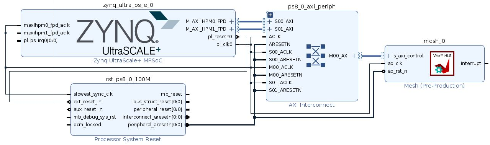

# Proteus: NoC simulator on FPGA using HLS
In this work, we want to design a functional NoC that can send ackets to and from various random nodes in the topology and trying to collect the data for the run-time metrics like average packet delay, max package latency, and average throughput. Although we might not get same values of what we get from GARNET, we expect to get similar trends in the hardware implementation as well.

# Instruction
## Vitis HLS
To run one of the topology: Ring/Mesh/Torus, user will need to first start with Vitis HLS 2021.1.

To Run with GUI:
1. Open Vitis HLS gui and create a new project.
2. For any given topology, add all files to design files and the main.cpp file should go to testbench. 
3. With this, the user will be able to run the C-level simulation. 

To Run with command line:
1. In the makefile of appropriate topology, change the AUTOPILOT to vitis HLS 2021.1. 
2. Now use 'make' to compile all the files to generate a executable.
3. Run "./results" to run the c++ simulation.

In addition, in the "common.h" file, the user can specify the number of nodes they want. And they can find what routing algorithm and traffic pattern we support. 

In "main.cpp" file, user can specify all these parameters including: Deadlock threshold, Number of packets per node, Packet inject period (1/Inject Rate), Routing Algorithm, Traffic Pattern.

To run sythesis for the Vitis resource utilization report and RTL code export, the user will need to specify the top funtion in "Project->Project Settings". The top function should be the topology name like "mesh". The next step after sythesis will be "Export RTL". This will generate a IP that can be used in vivado design.

For runing synthesis through command line, you go to the topology folder, and use the command 'make synth'.

During c level simulations, you can un-comment "DEBUG" flag in Router.cpp and <topology>.cpp.
## Vivado
1. User can open up Vivado and add the folder that contains the vitis generated IP to "IP Catalog".
2.  Then, create a block design and add a zynq core and the IP to the design. 
3. Notice that we are using ultra96 in our design. Then, running the block automation and connect automation, and a block design similar to Figure 1 should be done.
4. Hence, the user can "create HDL weapper" and run "Generate bistream". 
5. After the generation is done, user can export the hardware and put the "*.bit" and "*.hwh" file on FPGA board. 
6. The user can open up the jupternotebook we put in the "script" directory. Replacing the bit file name and those control parameters, user should be able to run the design easily.

